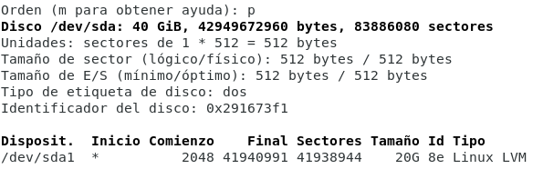
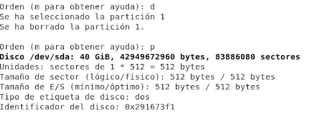
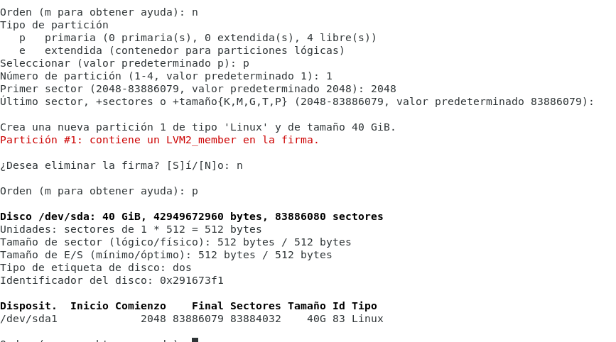
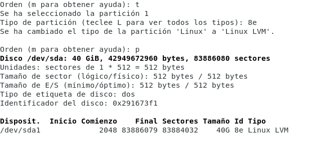

# Extender el tamaño del LVM para aprovechar todo el disco

https://blog.vbonhomme.fr/extend-a-lvm-partition-after-increasing-its-virtual-disk-on-virtualbox/

Partiendo del box **albmtez/debian-9-amd64**, vamos a cambiar las siguientes características de la máquina virtual:

- Aumentamos el tamaño del disco de 20GB a 40GB.
- Aumentamos la RAM de 1GB a 4GB.
- Aumentamos el número de CPUs de 1 a 2.

Para ello, usamos el [Vagrantfile](Vagrantfile) incluído.

Una vez creada y arrancada la máquina virtual, redimensionamos la partición, el PV (el VG de forma implícita) y extendemos el LV.

Vamos a suprimir la única partición existente y crear una nueva que comience en el mismo cilindro y que llegue hasta el último. Para ello:

```
$ sudo fdisk /dev/sda
```

Listamos las particiones con p:



Eliminamos la única partición existente con d:



Creamos una nueva partición con n, primaria, número 1 y comenzando en el sector 2048:



Cambiamos el tipo a 8e:



Validamos los cambios con w.

Reiniciamos para que se hagan efectivos los cambios.

Ya podemos extender el PV. Hacemos que tome todo el espacio disponible en la partición con:

```
$ pvresize /dev/sda1
```

Consultamos el estado:

```
$ sudo pvs
  PV         VG       Fmt  Attr PSize  PFree 
  /dev/sda1  systemvg lvm2 a--  40,00g 20,00g
```

Si queremos extender el LV de swap:

1. Deshabilitamos el swap.

```
$ sudo swapoff -v /dev/systemvg/swap
```

2. Redimensionamos, añadiendo 3GB.

```
$ sudo lvm lvresize /dev/systemvg/swap -L +2141M
```

3. Formateamos el nuevo espacio de swap.

```
$ sudo mkswap /dev/systemvg/swap
```

4. Habilitamos el volumen

```
$ sudo swapon -va
```

5. Comprobamos que se ha extendido.

```
$ sudo free -m
```

Ahora extendemos el LV:

```
$ sudo lvextend -l+100%FREE /dev/systemvg/root 
```

Los LVs quedan así:

```
$ lvs
  LV   VG       Attr       LSize   Pool Origin Data%  Meta%  Move Log Cpy%Sync Convert
  boot systemvg -wi-ao---- 476,00m                                                    
  root systemvg -wi-ao----  37,62g                                                    
  swap systemvg -wi-ao----   1,91g 
```

Por último, extendemos el filesystem para que use todo el espacio disponible del LV:

```
$ sudo resize2fs /dev/systemvg/root
```

En sistemas Centos, hay que utilizar el siguiente comando, en lugar de resize2fs:

```
$ sudo xfs_growfs /dev/systemvg/root
```

Por último, actualizamos el sistem:

```
$ sudo apt update
$ sudo apt upgrade
$ sudo apt autoremove
```

Exportamos la máquina para crear un nuevo box, que subimos con el nombre:

**albmtez/debian9-x64-m**
