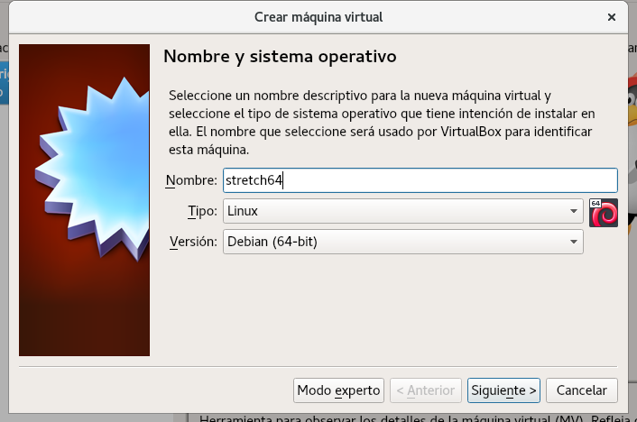

# Creación de un box base Debian 9 en Virtualbox

https://www.vagrantup.com/docs/boxes/base.html

Vamos a crear un box base con Debian 9.3.0 (Stretch) con Virtualbox.
Para ello, creamos una nueva máquina virtual:



Con las siguientes **características**:

* RAM: 1GB. Se podrá cambiar al crear máquinas desde Vagrant modificando el VagrantFile.
* vCPUs: 1. Modificable también desde el Vagrantfile.
* Creamos un disco virtual:
  * Formato VDI.
  * Reservado dinámicamente.
  * Tamaño: 20GB
* Deshabilitamos:
  * Controlador de Audio.
  * Controlador USB.
* Montamos la ISO de instalación de Debian 9.3.0.

Arrancamos la máquina virtual e instalamos:

* Password de root: vagrant
* Usuario: vagrant
* Password: vagrant
* Particionado (usamos LVM):
  * Una única partición primaria configurada como “Volúmen físico para LVM” y marca de arranque activada.
  * Un único VG con nombre “systemvg”.
  * Creamos 3 LV:
    * boot de 500MB.
    * swap de 2048MB.
    * root con el resto de espacio disponible en el vg.
  * Configuramos las particiones:
    * boot como ext4 y montada en /boot.
    * swap como área de intercambio.
    * root como ext4 y montada en /.
* En la selección de programas dejamos activado únicamente “Utilidades estándar del sistema”.
* Habilitamos el uso de paquetes contrib.
  * Modificamos el archivo /etc/apt/sources.list para incluir los paquetes “contrib”.
  * Hacemos ‘apt update’ y ‘apt upgrade’.
* Instalamos algunos paquetes:
  * net-tools
  * linux-headers-$(uname -r)
  * build-essential
  * dkms
  * ssh
* Instalamos las Virtualbox Guest Additions.

## Umask, permisos $HOME y configuración bash

Vamos a establecer la máscara por defecto para restringir los permisos en los directorios y archivos creados. Editamos el archivo **/etc/login.defs**, buscamos la línea UMASK y establecemos el valor:

```
UMASK 027
```

Ahora editamos el archivo **/etc/pam.d/common-session** y añadimos al final:

```
session optional pam_umask.so
```

Cerramos sesión para aplicar los cambios en el próximo login.

Quitamos permisos a $HOME y directorios incluidos:

```
$ chmod 700 $HOME
$ chmod 700 $HOME/*
```

Establecemos algunos alias en bash, editando ~/.bashrc y descomentando las líneas siguientes:

```
# some more ls aliases
#alias ll='ls -l'
#alias la='ls -A'
#alias l='ls -CF'
```

Hacemos los mismo para el usuario root, editando su .bashrc y descomentando las líneas:

```
# You may uncomment the following lines if you want `ls' to be colorized:
# export LS_OPTIONS='--color=auto'
# eval "`dircolors`"
# alias ls='ls $LS_OPTIONS'
# alias ll='ls $LS_OPTIONS -l'
# alias l='ls $LS_OPTIONS -lA'
```

## Sudo sin password

Editamos el archivo de sudoers con el comando ‘visudo’ y añadimos al final:

```
vagrant ALL=(ALL) NOPASSWD: ALL
```

## SSH Insecure Keypair

Descargamos el archivo vagrant.pub de https://github.com/mitchellh/vagrant/tree/master/keys.

Lo renombramos como authorized_keys y le damos permisos 0600.

Creamos el directorio $HOME/.ssh, con permisos 0700.

Movemos el archivo authorized_keys a $HOME/.ssh.

## Generación del box

Empaquetamos el box ejecutando:

```
$ vagrant package --base stretch64
```

Para probar el box, hemos de importarlo:

```
$ vagrant box add --name stretch64 package.box
```

Ya podemos hacer un **vagrant init** y **vagrant up**.